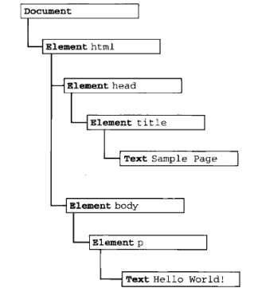
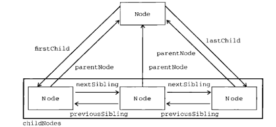

DOM可以将任何HTML或XML文档描述成为一个由多层节点构成的结构。

以下面的结构为例
```html
<html>
  <head>
    <title></title>
    <!-- 这是注释 -->
  </head>
  <body></body>
</html>
```
节点分为几种不同的类型，记录着文档中不同的信息，都有自己的特点、数据和方法，也和其他节点存在某种关系，节点之间的关系，构成了层级关系。比如：html元通过元素节点表示，特性通过特性节点表示，文档类型通过文档类型节点表示，而注释则通过注释节点表示

文档节点是每个文档的跟节点。而文档节点，我们称之为--- document

总共有12种节点类型，这些类型都继承自一个基类型



###  节点类型
每个节点都有一个nodetype属性，用于表明节点的类型。
> Node.ELEMENT_NODE                 element类型           nodetype => 1
> Node.ATTRIBUTE_NODEE              attribute类型         nodetype => 2
> Node.TEXT_NODE                    text 文本类型         nodetype => 3
> Node.CDATA_SECTION_NODE           cdtaSelection类型     nodetype => 4
> Node.ENTITY_REFERENCE_NODE        entityRef(实体引用)   nodetype => 5
> Node.ENTITY_NODE                  entity(实体)类型      nodetype => 6
> Node.PROCESSING_INSTRUCTION_NODE  processing(处理指令)  nodetype => 7
> Node.COMMENT_NODE                 comment(注释)类型     nodetype => 8
> Node.DOCUMENT_NODE                document类型          nodetype => 9
> Node.DOCUMENT_TYPE_NODE           documentType类型      nodetype => 10
> Node.DOCUMENT_FRAGMENT_NODE       documentFragment类型  nodetype => 11
> Node.NOTATION_NODE                notationt类型(DTD)    nodetype => 12

根据上面的属性，可以判断节点的类型
```javascript
document.nodeType === Node.DOCUMENT_NODE  // true

let node = document.querySelector('xxx') // 获取节点
if(node.nodeType === Node.xxxx) {
  ...
}
```

### 节点关系
文档中所有的节点，都存在这样或者那样的关系。节点间的各种关系可以使用家族关系来描述。

祖>爷>爹>儿  层层嵌套

同层之间的为兄弟姐妹



因此，每个节点都会有ParentNode(父亲只有一个)和childNodes(多个孩子[Nodelist])属性

如果想去兄弟姐妹家里玩玩

那么采用 `nextSibling()` (下一个)和`previouSibling()` 获取他们的地址

而父亲可能偏爱最后一个节点和第一个节点，可以通过lastChild和firstChild访问，其他的只能通过childNodes[1] 下标的方式访问

### 节点操作

节点操作，无非是增删查找

```javascript
appendChild(node)
inserBefore(node) 
replaceChild(node)
removeChild(node)

cloneNode(Boolean)  // true表示深拷贝  克隆后的节点，是个孤儿，因为不指定父节点
....
```


