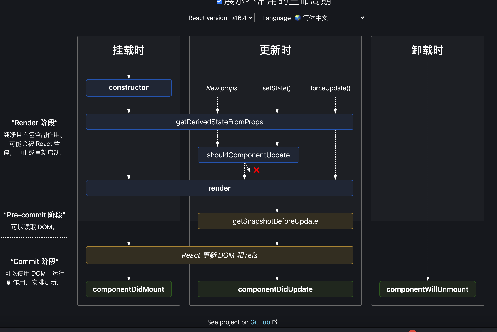

### 旧版生命周期
> Initialization 初始化

  setup props and state

> Mounting  挂载

* componentWillMount  （后续版本可能回执行多次, 或者移除）
* render
* componentDidMount （永远只会执行一次）

因此，推荐将获取接口数据更新放在 componentDidMount 中执行
虽然，放在构造函数中获取数据也可以，但是如果接口报错或者请求时间过长，可能回导致组件渲染不不来
> updation 更新

#### 更新props
* componentWillReceiveProps
* shouldComponentUpdate  如果返回true ,继续 往下，否则终止
* componentWillUpdate
* render
* componentDidUpdate

#### 更新state

* shouldComponentUpdate  如果返回true ,继续 往下，否则终止
* componentWillUpdate
* render
* componentDidUpdate

> Unmounting 卸载
 
* componentWillUnmount


### 新版生命周期


删除了componentWillMount, componentWillUpdate, componentWillUpdate

增加了 
* getDerivedStateFromPros  根据新的属性对象派生状态对象（可让 props混合到state中，这样jsx页面就可全部采用this.state获取数据 ）

* getSnapshotBeforeUpdate 获取更新前的快照， 这个函数的返回值将在componentDidMount中接受

```jsx
getSnapshotBeforeUpdate() {
  return this.test
}
componentDidMount(prevProps, prevStates, test) {
  
}
```

新版兼容旧版的写法
