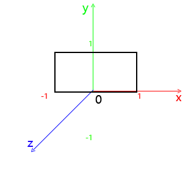

了解webgl的坐标系

 


1. canvas画布宽高采用的是像素值定义，以显示器为准，WebGL中顶点坐标的表示方法采用的是相对坐标，相对于canvas而言 WebGL坐标系统，X轴水平向右，也就是canvas画布的width表示的宽度方向，x=-1表示canvas画布的左边界，x=1表示canvas画布的右边界，x=0对应的是画布宽度方向的中间。
   
2. WebGL坐标系统，Y轴竖直向上，也就是canvas画布的height表示的高度方向，y等于-1表示canvas画布的下边界，y等于1表示canvas画布的上边界，y等于0对应的是画布高度方向的中间。

3. WebGL坐标系统，Z轴垂直canvas画布朝外，Z值-1和1是Z方向的极限值，GPU成像默认的沿着Z轴投影，也可以抽象出一个概念，人眼睛位于z轴上，沿着z轴方向去观察物体，如果你在其他的书上看到视图坐标系等其它各类坐标系都是抽象出的概念，都是建立在上面所说的WebGL坐标系统之上，例如无人机导航中的所说的机体坐标系、地球坐标系都是直接对现实中事物的描述，三维场景中的各类坐标系与无人机中坐标系没什么区别，但是要显示在屏幕上，就要经过一些处理，通过正射投影和透射投影来展示在屏幕上。
   
4. 二维坐标中， webgl的Y轴与浏览器DOM坐标的Y轴，方向相反
   
5. 无论你的画布有多大，裁剪空间的坐标范围永远是 -1 到 1 

因此，坐标与屏幕大小有映射关系

假设画布的大小为 400 × 300
```javascript
裁剪空间           屏幕空间
  0, 0       ->   200, 150
  0, 0.5     ->   200, 225
  0.7, 0     ->   340, 150
```