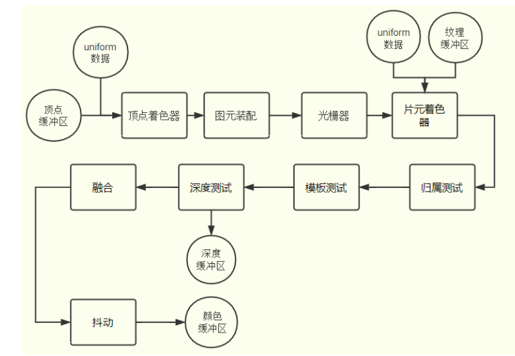

管道渲染是图形学中比较底层的东西

[知乎文章](https://zhuanlan.zhihu.com/p/79183044)

[这里只是做简单的webgl学习笔记](http://www.webgl3d.cn/WebGL/)

#### 渲染管线流程图

流程图，对于学习webgl非常的重要。

[webgl文档教程](https://webglfundamentals.org/webgl/lessons/zh_cn/webgl-fundamentals.html#toc)