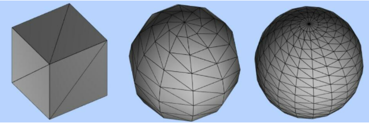

由最基本的数学知识入手，点成线-> 线成面->面成体

因此，三维物体都是可以通过点的方式表示出来的，比如正方形需要4个点，正方体需要8个点，而球我们需要知道圆心和半径，即相当于将圆心往外扩散

### js类型化数组
在three.js中我们采用类型化数组来表示几何体的顶点

### 自定义几何体
```js
var geometry = new THREE.BufferGeometry(); //创建一个Buffer类型几何体对象
//类型数组创建顶点数据
var vertices = new Float32Array([
  0, 0, 0, //顶点1坐标
  50, 0, 0, //顶点2坐标
  0, 100, 0, //顶点3坐标
  0, 0, 10, //顶点4坐标
  0, 0, 100, //顶点5坐标
  50, 0, 10, //顶点6坐标
]);
// 创建属性缓冲区对象
var attribue = new THREE.BufferAttribute(vertices, 3); //3个为一组，表示一个顶点的xyz坐标
// 设置几何体attributes属性的位置属性
geometry.attributes.position = attribue;


// 三角面(网格)渲染模式
var material = new THREE.MeshBasicMaterial({
  color: 0x0000ff, //三角面颜色
  side: THREE.DoubleSide //两面可见
}); //材质对象
var mesh = new THREE.Mesh(geometry, material); //网格模型对象Mesh

// 点渲染模式
var material = new THREE.PointsMaterial({
  color: 0xff0000,
  size: 10.0 //点对象像素尺寸
}); //材质对象
var points = new THREE.Points(geometry, material); //点模型对象
scene.add(points); //点对象添加到场景中

// 线条渲染模式
var material=new THREE.LineBasicMaterial({
    color:0xff0000 //线条颜色
});//材质对象
var line=new THREE.Line(geometry,material);//线条模型对象
scene.add(line);//线条对象添加到场景中
```

### 几何体的本质
立方体几何体BoxGeometry本质上就是一系列的顶点构成，只是Threejs的APIBoxGeometry把顶点的生成细节封装了，用户可以直接使用。

比如一个立方体网格模型，有6个面，每个面至少两个三角形拼成一个矩形平面，每个三角形三个顶点构成，对于球体网格模型而言，同样是通过三角形拼出来一个球面，三角形数量越多，网格模型表面越接近于球形。



