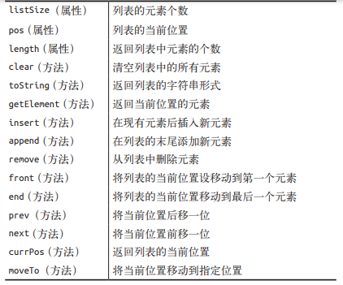

### 列表的抽象数据类型定义
列表是一组有序的数据。

主要应用： 
  * web浏览器历史管理
  * 底层内存管理
  * 实现hash表（数组和链表的结合实现）
  * 文件系统
列表具有的一些属性



### 实现列表类
根据上图，从定义结构开始
```javascript
function List(){
  this.listSize = 0;       // 列表元素个数
  this.pos = 0;            // 当前位置
  this.dataStore = [];     // 初始化一个空数组来保存列表元素
  this.clear = clear;      // 清空列表元素
  this.find = find;        // 找到指定元素
  this.toString = toString; // 列表字符串形式
  this.insert = insert;     // 插入元素
  this.append = append;     // 添加元素
  this.remove = remove;     // 删除元素
  this.front = front;       // 将当前位置移到第一位
  this.end = end;           // 将当前元素移到最后一位
  this.prev = prev;         // 当前位置后移一位
  this.next = next;         // 当前位置前移一位
  this.length = length;
  this.currPos = currPos;   // 返回列表当前位置
  this.moveTo = moveTo;
  this.getElement = getElement;
  this.length = length;
  this.contains = contains;

}
let a = new List();
```
### 增、删、查
```javascript
// 增
function append(ele){
  // 新元素入列，长度listSize加一
  this.dataStore[this.listSize++] = ele
}
// 查
function find(ele){
  for (let i = 0; i <this.dataStore.length; i++) {
    if(this.dataStore[i] === ele){
      return i; // 找到返回下标
    }
  }
  return -1; // 找不到返回 -1
}
// 删
function remove(ele) {
  let index = this.find(ele;
  if(index > -1){
    this.dataStore.splice(index, 1);
    --this.listSize;
    return true;  // 删除成功返回false
  }
  return false;  // 不存在元素，返回false
}
```
### 列表中有多少个元素
```javascript
function length(){
  return this.listSize;
}
```
也可以直接采用实例属性
```javascript
let a = new List();
a.listSize; 
```

### 显示列表元素
```javascript
function toString(){
  return this.dataStore;  // 返回数组，而不是字符串
}
```

### 列表插入
```javascript
// 在某个元素之后插入
function insert(ele,after){
  let index = this.find(after);
  if(index > -1){
    this.dataStore.splice(index,0,ele);
    ++this.listSize;
    return true;
  }
  return false;
}
```

###  清空列表
```javascript
function clear(){
  delete this.dataStore;
  this.dataStore = [];
  this.listSize = this.pos = 0;
}
```

### 判断值是否包含在列表中
```javascript
function caontains(ele) {
  for(let i =0,len = this.dataStore.length; i< len; i++){
    if(this.dataStore[i] === ele){
      return true;
    }
  }
  return false;
}
```

### 遍历列表
```javascript
function front(){
  this.pos = 0;
}
function end(){
  this.pos = this.listSize;
}
function prev(){
  if(this.pos > 0){
    --this.pos;
  }
}
function next(){
  if(this.pos < this.listSize){
    ++this.pos;
  }
}
function currPos() {
  return this.pos;
}
function moveTo(position) {
  this.pos = position
}
function getElement(){
  return this.dataStore;
}
```