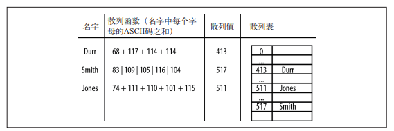

### 简单描述
散列是一种常见的数据存储技术，散列后的数据可以快速地插入或取用。散列使用的数据结构叫散列表。

其实就是js中常说的 obj = {}
而hash冲突时解决 obj.a  与 obj.b 拿到的是同一个索引的问题

```js
var a = 123
var obj = {}
obj.a = a;
obj.b = a;
```

在散列表上插入、删除和取用数据都很快，但是对于查找操作来说却效率低下，比如查找一组数据中的最大值和最小值。

使用散列表存储数据时。通过一个`散列函数`将键映射为一个数字，这个数字的范围是 0 到散列表的长度

比如:将姓名和电话号码映射为一个关系



散列表基于数组进行设计，数组的长度是预先设定的，如有需要，可随时添加。

面临的问题：

- 理想情况下每个键值映射一个，当两个键映射为一个值，如果解决碰撞问题
- 散列表的数组应该多大？数组的长度限制为质数，为什么？

这需要通过设计散列函数去解决
### 代码实现
```javascript
function HashTable() {
  // 数组长度为质数
  this.table = new Array(137)
  this.simpleHash = simpleHash // 生成hash值
  this.showDistro = showDistro // 数据展示
  this.put = put // 数据存入
  this.get = get
}
```

散列函数的选择依赖于键值的数据类型。如果键是整型，最简单的散列函数就是以数组的
长度对键取余(arr.length % key)。在一些情况下，比如数组的长度是 10，而键值都是 10 的倍数时，就不推荐使用这种方式了(取余后都为 0)。这也是数组的长度为什么要是质数的原因之一，就像我们在上个构造函数中，设定数组长度为 137 一样。如果键是随机的整数，则散列函数应该更均匀地分布这些键。这种散列方式称为除留余数法。

这里列举一些常用的散列函数
```js
// 处理整数  k => k % M // 就是上面的保留余数法

// 处理浮点数  k => binary_value(k) % M
function binary_value(k) {
  // byte = 8bit
  // NUmber占4byte, 即 32bit
  const farr = new Float32Array(1)
  farr[0] = val
  const intBytes = new Int8Array(farr.buffer)
  const view = new DataView(intBytes.buffer)
  return view.getUnit32()
}
// 处理字符串
function h_str(str, M) {
  return [...str].reduce((hash, c) => {
    // 乘以一个质数
    hash = (31 * hash + c.charCodeAt(0)) % M
    return hash
  }, 0 /* 初始值为 0*/)
}
```
将字符串(键)中每个字符的 ASCII 码值相加似乎是一个不错的散列函数,结合保留余数法

```javascript
function simpleHash(data){
  let total = 0;
  for(let i=0; len = data.length; i <len; i++){
    total += data.charCodeAt(i);
  }
  return total % this.table.length;
}
```

存和展示数据

```javascript
function put(data) {
  let pos = this.simpleHash(data)
  // hash值--> data
  this.table[pos] = data
}

function showDistro() {
  for (let i = 0; i < this.table.length; i++) {
    if (this.table[i] !== undefined) {
      console.log(i + ':' + this.table[i])
    }
  }
}
```

简单测试

```javascript
// 九个数据
let someNames = [
  'David',
  'Jennifer',
  'Donnie',
  'Raymond',
  'Cynthia',
  'Mike',
  'Clayton',
  'Danny',
  'Jonathan',
]
let hTable = new HashTable()
for (let i = 0; i < someNames.length; ++i) {
  hTable.put(someNames[i])
}
hTable.showDistro()
/* 
// 输出只有6个数据，说明存在冲突
35: Cynthia
45: Clayton
57: Donnie
77: David
95: Danny
116: Mike
132: Jennifer
 */
```

解决冲突，引入更好的散列函数
```javascript
// 霍纳算法，计算hash值
function betterHash(string){
  const H = 37;
  let total = 0;
  for(let i= 0; i<string.length; i++){
    // 每次都乘以一个质数 H 
    total += H * total + string.chatCodeAt(i);
  }
  total =  total % this.table.length;
  if(total < 0){
    total += this.table.length -1;
  }
  return parseInt(total);
}
// 修改put中使用 betterHash()
function put(data) {
  let pos = this.betterHash(data)
  // hash值--> data
  this.table[pos] = data
}
```

测试betterHash()
```javascript
let someNames = ["David", "Jennifer", "Donnie", "Raymond",
"Cynthia", "Mike", "Clayton", "Danny", "Jonathan"];
let hTable = new HashTable();
for (let i = 0; i < someNames.length; ++i) {
hTable.put(someNames[i]);
}
htable.showDistro();
/* 
 // 结果输出
17: Cynthia
25: Donnie
30: Mike
33: Jennifer
37: Jonathan
57: Clayton
65: David
66: Danny
99: Raymond
 */
```

### 散列化整型键
上面的betterHash()是针对字符串类型的，如果出现整型数据类型，该如何处理，比如学号->成绩

随机产生一个9位数的键，用以识别学生身份和一门成绩
```javascript
// 生成指定区域的一位随机数
function getRandomint(min,max){
  return Math.floor(Math.ramdom() * (max-min+1))+ min
}
function getStuData(arr){
  for(let i = 0; i < arr.length; i++){
    let num = '';
    for(let j =1; j<=9; j++){
      // 生成学生id
      num += Math.floor(Math.random() * 10)
    }
    num += getRandomInt(50,100);
    arr[i] = num; // 每个学生id放回数组中
  }
}
// put函数中，如果采用simpleHash那么很可能会产生碰撞冲突。
```


### 散列表排序、从散列表中取值
修改get 和 put方法
```javascript
function put(key,data){
  let pos = this.betterHash(key);
  this.table[pos] = data;
}
function get(key){
  let pos = this.betterHash(key);
  return this.table[pos]
}
```


### 碰撞处理

#### 开链法
#### 线性探测法
