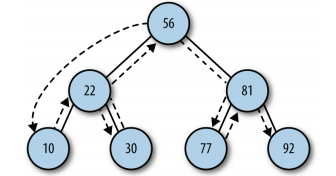

### 二叉树
二叉树是一棵特殊的树，它的子节点不超过两个

其他的属性，可类比我们生活中的树的例子。

树的层节，与我们直观的树结构是相反的，层次描述自下而上
树节点 ----> 第零层，子节点 ---> 第一层， 依次递归下去。

### 二叉查找树
二叉查找树是特殊的二叉树， 相对较小的值保存在在左边节点，较大的值保存在右边节点


下面主要实现二叉查找树

### 实现二叉查找树

```javascript
/**
 * @description 树的节点
 */
function Node(data,left,right){
  this.data = data;
  this.right = right;
  this.left = left;
  this.show = show;
}
function show(){ // 显示保存在节点中的数据
  return this.data;
}

/**
 * @description 二叉查找树的描述
 */
function BST(){
  this.root = null;
  this.insert = insert;
  this.inOrder = inOrder;
}
```
> 树的节点插入
1. 首先判断树是否有根，如果没有那么是一颗新树，该节点就是根节点，否则查询（第二步）
2. 遍历BST(类似链表的遍历),找到合适的位置将节点插入

如何找到正确的插入点
1. 设置当前节点为根节点 `let current = this.root`
2. 如果小于当前节点`current`，设置新的`current = current.left`, 继续往下对比，否则设置`current = current.right`
3. 如果当前节点的左节点为空，将新的节点插入这个位置，退出循环；否则继续下一次循环
4. 同理设置`current = current.right`的时候，如果当前节点的右节点为空...

```javascript
function insert(data){
  let n = new Node(data,null,null);
  if(!this.root){
    this.root = n
  }else{
    let current = this.root;
    let parent;
    while(true){
      parent = current;
      if(data < current.data){ // 小于，往左边遍历
        current = current.left;
        if(current == null){
          parent.left = n;  
          break;
        }
      }else{
        current = current.right;
        if(current == null){
          parent.right = n
          break;
        }
      }
    }
  }
}
```
> 树的遍历

+ 中序遍历
  左->根->右
  
  先遍历左子树，然后输出根子节点，然后遍历右子树，从最底层、最底层的左节点开始，按照 左->中->右，开始遍历
  
  依据上图得到的顺序： 10 22 30 56 77 81 92

  采用递归的方式实现
  ```javascript
  function inOrder(node){
    if(node !== null){
      inOrder(node.left);
      console.log(node.show())
      inOrder(node.right);
    }
  }
  ```
+ 前序遍历
  根->左->右
  
  先输出根节点，然后遍历左子树，然后遍历右子树，按照中-左-右的方式遍历
  
  50 10 5 15 70 60 80 
  ```javascript
  function preOrder(node){
    if(node !== null){
      console.log(node.show())
      preOrder(node.left)
      preOrder(node.right)
    }
  }
  ```
+ 后序遍历
  左->右->根
  
  先遍历左子树，然后遍历右子树，然后输出根节点，子树按照左-右-中的方式遍历  3 22 16 37 99 45 23
```javascript
function postOrder(node){
  if(node !== null){
    postOrder(node.left);
    postOrder(node.right);
    console.log(node.show);
  }
}
```

> 树的查找
树的查找，主要包括三大类
(1)给定值查找

(2)查找最大值

(3)查找最小值

```javascript
// 最小值，只需要在左子树上面进行往下遍历即可
function getMin(){
  let current = this.root;
  while(!(current.left == null)){
    current = current.left;
  }
  return current.data;
}
// 最大值只需在右子树上面往下遍历即可
function getMax(){
  let current = this.root;
  while(current.right !== null){
    current = current.right;
  }
  return current.data;
}
// 给定值查找，先和根节点做判断，再进行对应子树的遍历
function find(data){
  let current = this.root;
  while (current != null) {
    if (current.data == data) {
      return current;
    }
    else if (data < current.data) {
      current = current.left;
    }
    else {
      current = current.right;
    }
  }
  return null;
}
```

> 树的节点删除

树的节点的删除是最复杂的
1. 判断当前节点，是否包含待删除的数据，如果包含删除，否则判断数据的大小，决定往左子树，还是右子树。
2. 如果待删除的节点是叶子节点(即没有子节点的节点，处于最分支的最后)，那么将数据置为null即可
3. 如果待删除节点包含一个子节点，那么指针需要调整，待删除的父节点需要指向待删除的子节点
4. 如果待删除包含两个子节点，要么找到左子树最大值，要么找到右子树最小值，然后重新调整指针。

整个删除过程，由两部分组成
```javascript
function remove(data){
  return removeNode(this.root,data)
}
function removeNode(node,data){
  if(node == null){
    return null
  }
  if(data === node.data){
    // 没有子节点
    if(node.left == null && node.right == null){
      return null
    }
    // 没有左节点
    if(node.left == null){
      return node.right
    }
    if(node.right == null){
      return node.left
    }
    // 存在两个子节点，
    let tempNode = getSmallest(node.right)
    node.data = tempNode.data;
    node.right = removeNode(node.right,tempNode.data);
    return node
  }else if(data < node.data){
    node.left = removeNode(node.left,data)
    return node
  }else{
    node.right = removeNode(node.right,data)
    return node
  }
}
```