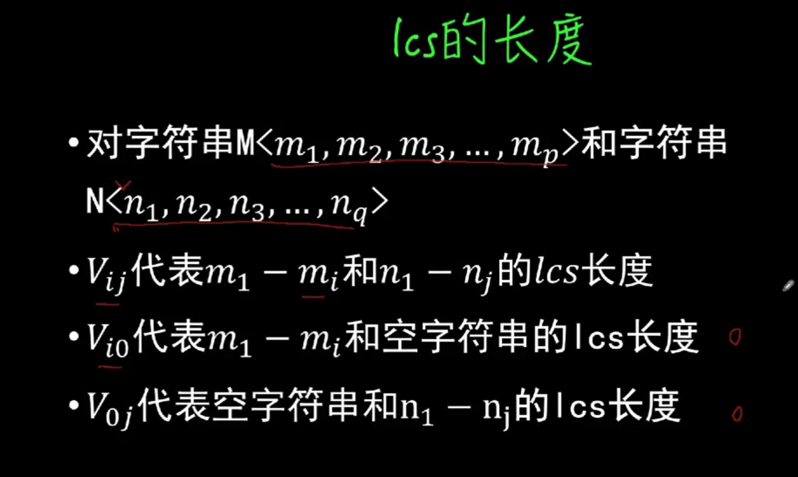
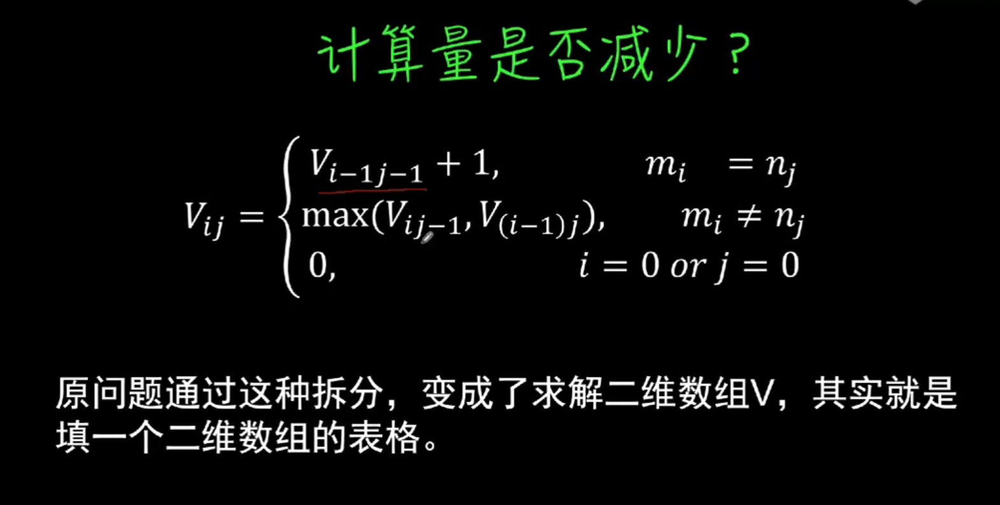
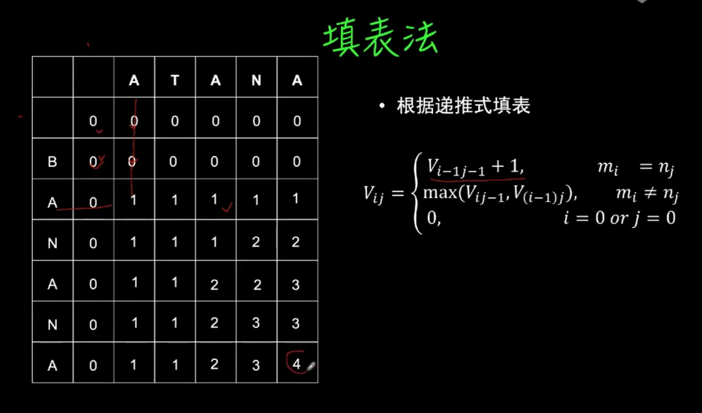
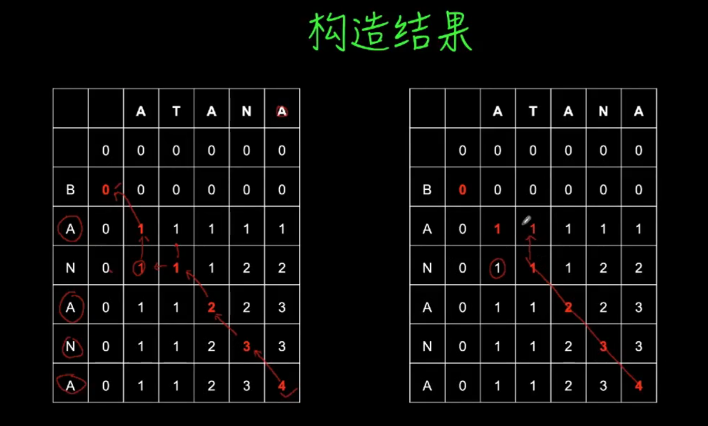

### 动态规划(Dynamic Programming)

动态规划处理的是一类可以被递归描述的问题, 用于处理最优化问题的方法

特点： 问题必须可以递归描述
      有很多的重复计算的子结构（例如斐波那契数列的递归）

从地步向上构造整个解， 使得所有子问题计算都只有一次

```js
function fib(n) {
  if(n <= 2) return 1
  let a = 1  // 缓存数据
  let b = 1  // 缓存数据
  for(let i = 2; i < n; i++) {
    [b, a] = [a+b, b]
  }
  return b
}
```

但是有时候问题没有那么简单，缓存数据可能是一个二维数组或者其他更加复杂的数据结构

例如公共子序列问题

什么是公共子序列？

就是原序列不改变顺序，但是可以删除元素得到的序列。

例如 ABC 有 8 个子序列
* A
* B
* C
* AB
* AC
* BC
* ABC
* 空字符串

为什么要求公共子序列？ 在公共领域应用是很广泛的， 例如DNA的螺旋结构比较

例子； lcs(ABCBDAB,BDCABA)

最长lsc有三种： lsc长度  = 4 , BDAB, BCAB 和 BCBA


```js
function lcs(s, t) {
  if(s === '' || t === '')  {
    return 0
  }
  // 如果末尾相同
  if(s[s.length - 1] === t[t.length-1]) {
    return lcs(s.substr(0, s.length-1), s.substr(0, t.length -1)) + 1
  } else {
    return Math.max(lcs(s.substr(0, s.length -1), t) , lcs(s, t.substr(0, t.length - 1)))
  }
}
```

递归已经写出来了，但是怎么获取这个递归的最优解

看下面的过程








js实现

```js
function lcs(s, t) {
  const dp = []
  for(let y = 0; y <= t.length; y++) {
    dp[y] = []
    for(let x = 0; x <  s.length; x++) {
      if(x === 0 || y=== 0) {
        dp[y][x] = 0
      } else if(s[x-1] === t[y-1]) {
        dp[y][x] = dp[y-1][x-1] + 1
      } else {
        dp[y][x] = Math.max(dp[y-1][x], dp[y][x-1])
      }
    } 
  }
  return dp[t.length][s.length]
}
```

上面的程序只是得到 lcs的长度，那具体的lcs是什么？

通过填表法可以很清晰的看到结果

js实现

```js
function get_result(dp, s,t,x =s.length, y = t.length, result = '') {
  if(x === 0 || y === 0) return result\
  if(s[x-1] === t[y-1]) {
    return get_result(dp, s, t, x-1, y-1,result + s[x-1])
  } else {
    if(dp[y-1][x] > dp[y][x-1]) {
      return get_result(dp, s, t, x, y-1, result)
    } else {
      return get_result(dp, s, t, x-1, y, reuslt)
    }
  }
}
```


总结

1. 思考递归解法
2. 确定子问题结构和递归表达式
3. 利用填表法由地步向上构造解
4.利用程序从表中读取结果


