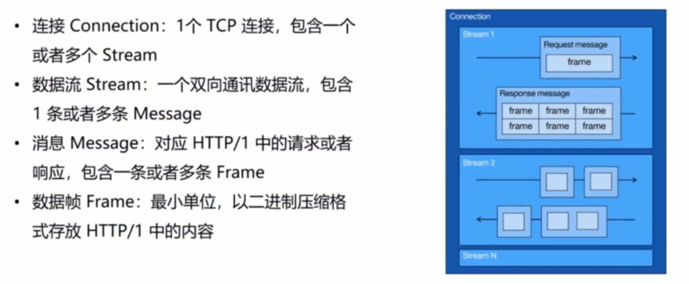
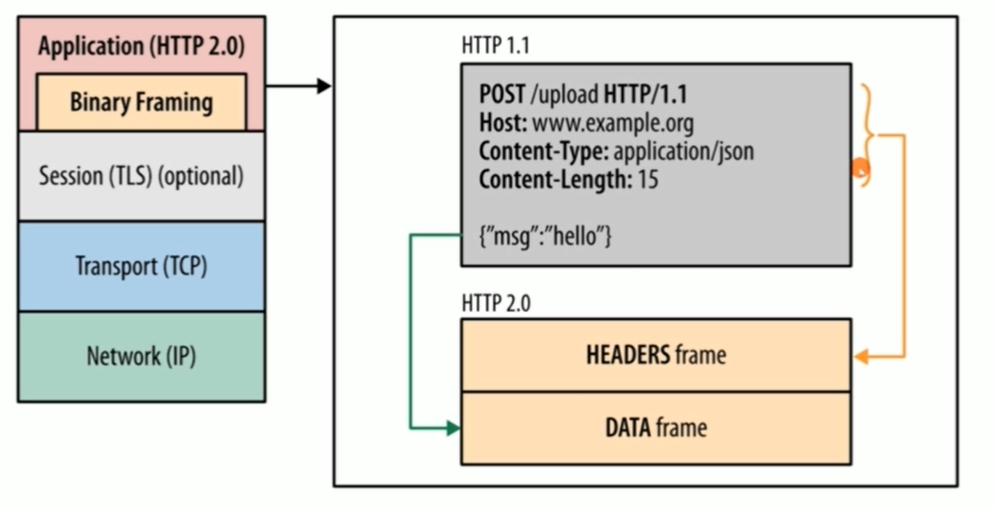
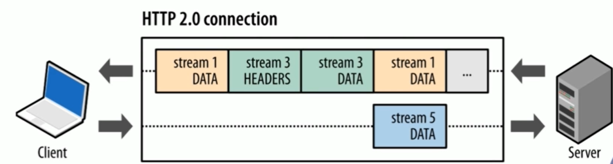
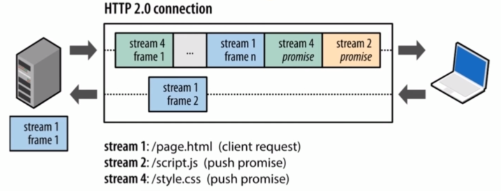
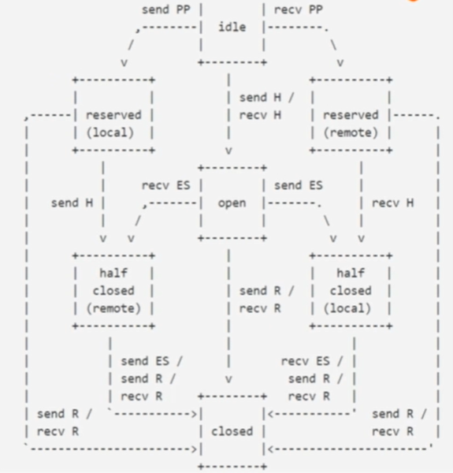
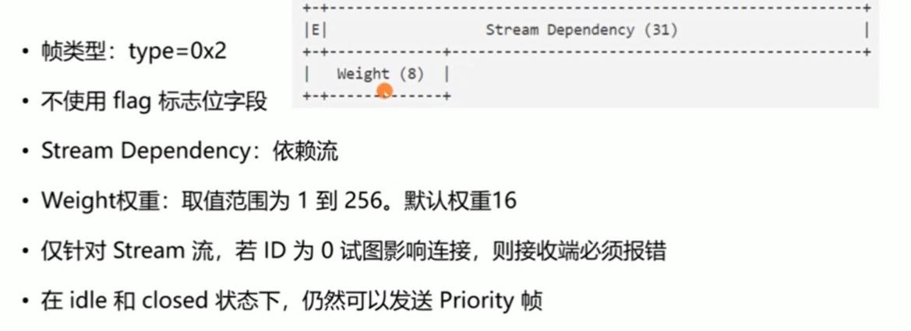
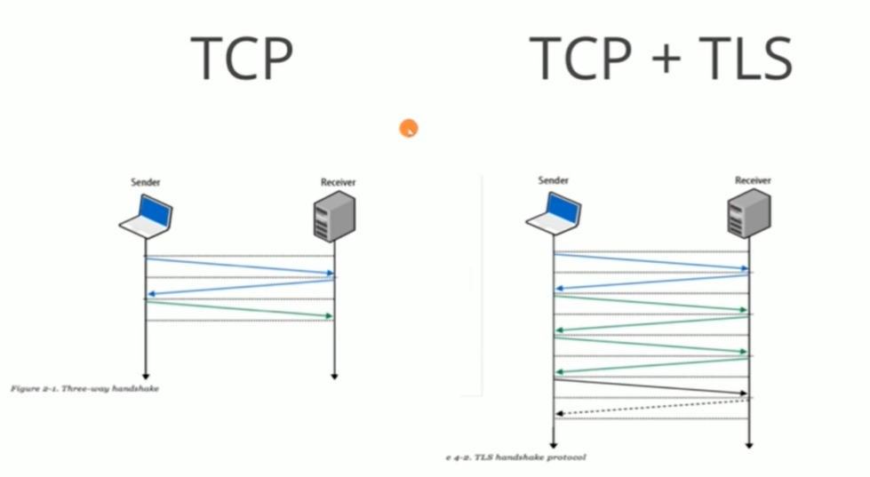
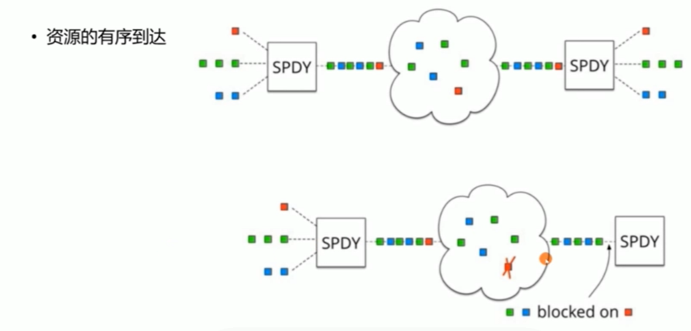

## HTTP/1.1 从发明以来发生了哪些变化

- 从几 kb 大小的消息，到几 MB 大小的消息

- 每个页面小于 10 个资源，到每个页面 100 多个资源

- 从文本为主的内容，到富媒体（如图片、声音、视频）为主的内容

- 对页面内容实时性高要求的应用越来越多

## HTTP/1.1 的问题

### HTTP/1.1 的高延迟问题

- 高延迟带来页面加载速度的降低
  - 随着带宽的增加，延迟并没有显著下降
  - 并发连接有限
  - 同一连接同时只能在完成一个 HTTP 事务（请求/响应）才能处理下一个事务

### 无状态特性带来的巨大 HTTP 头部

- 重复传输的体积巨大的 HTTP 头部

### HTTP 为了解决性能问题做过的努力

- Spriting (精灵图)合并多张小图为一张大图供浏览器 JS 切割使用
  - 不能区别对待
- Inlining 内联，将图片嵌入到 CSS 或者 HTML 文件中，减少网络请求次数（即 base64）
- Concatenation 拼接，将多个体积较小的 JavaScript 使用 webpack 等工具打包成 1 个体积更大的 JavaScript 文件
- 1 个文件的改动导致用户重新下载多个文件
- Sharding 分片，将同一页面的资源分散到不同域名下，提升连接上限

### HTTP/1.1 不支持服务端推送

## HTTP-2 特性概述

HTTP 的前身是 SPDY 协议

- SPDY(2012-2016)
- HTTP2 (RFC7540，2015.5)
  - 在应用层上修改，基于并充分挖掘 TCP 协议性能
  - 客户端向 server 发送 request 这种基本模型不会变
  - 老的 scheme 不会变，没有 http2://。
  - 使用 http/1x 的客户端和服务器可以无缝的通过代理方式转接到 http/2 上。
  - 不识别 http/2 的代理服务器可以将请求降级到 http/1.x

## HTTP/2 主要特性

### 传输数据量的大幅减少

- 以二进制方式传输
- 标头压缩

### 多路复用及相关功能

- 消息优先级

### 服务器消息推送

- 并行推送(不同的 stream 是可以并发的，同一个 stream 中的 frame 由于需要保证有序所以是没办法并发的)

## TLS 加密

所有的浏览器都规定 HTTP/2 必须运行在 TLS 之上

### TLS1.2 的加密算法

- 常见加密套件

  - 

- 对称加密算法： AES_128_GCM

  - 每次建立连接后，加密密钥都不一样

- 密钥生成算法： ECDHE
  - 客户端与服务器通过交换部分信息，各自独立生成最终一致的密钥

### HTTP/2 是不是必须基于 TLS/SSL 协议?

- IETF 标准不要求必须基于 TLS/SSL 协议
- 浏览器要求必须基于 TLS/SSL 协议（为什么？1、网络安全， 2、握手，就算 http/2 不基于 TLS 也需要一个东西建立握手）
- 在 TLS 层 ALPN(Application Layer Protocol Negotiation)扩展做协商，只认 HTTP/1.x 的代理服务器不会干扰 HTTP/2
- shema: http://和 https:// 默认基于 80 和 443 端口
- h2:基于 TLS 协议运行的 HTTP/2 被称为 h2
- h2c:直接在 TCP 协议之上运行的 HTTP/2 被称为 h2c

## HTTP2 核心概念

从上面的图可知，流由消息构成，消息由帧构成

下面看一下消息的组成

消息的组成主要包括两部分： HEADERS 帧与 DATA 帧

### 帧格式： Stream 流 ID 的作用

stream id 主要有以下作用

1、实现多路复用的关键。
2、推送依赖性请求得关键。
3、流状态管理的约束性规定。
4、应用层流控仅影响数据帧（stream id 为 0 的流仅用于传输控制帧）。

#### 实现多路复用的关键

- 接收端的实现可依据此并发组装消息

- 同一 Stream 内的 frame 必须是有序的（无法并发）

- SETTINGS_MAX_CONCURRENT_STREAMS 控制着并发 Stream 数

#### 推送依赖性请求的关键

- 由客户端建立的流的 id 必须是基数
- 由服务端建立的流的 id 必须是偶数

#### 流状态管理的约束性规定

- 新建立的流 ID 必须大于曾经建立过的状态为 opened 或者 reserved 的流 ID

- 在新建立的流上发送帧时， 意味着将更小 ID 且为 idle 状态的流置为 closed 状态

- Stream ID 不能复用， 长连接耗尽 ID 应创建新连接

## HPack 如何减少 HTTP 头部的大小？

http 是无状态的，因此每次请求都需要发送重复头部，如果头部数据很大将影响效率

http2 采用 HPack 头部压缩解决这个问题

### HPACK 头部压缩

#### 三种压缩方式

- 静态字典（索引表）
- 动态字典
- 压缩算法： Huffman 编码（压缩有限），一般压缩一些不能通过静态或者动态字典进行压缩的，比如 cache-control 字段

通过上面三种方式，压缩头部

## HTTP2 服务端推送

### 服务端推送的价值

提前将资源推送至浏览器缓存

推送可以基于已经发送的请求，例如客户端请求 html,主动推送 js 文件

例如： 当获取 HTML 后，需要 css 资源时，http1.1 中，需要 2 个 RTT

而在 HTTP2 中，通过 get 请求 html 资源，那么服务器响应 Stream1（html 文件），在这个 Stream1 中通知客户端 CSS 资源即将来临，然后在 Stream2 中自动推送 css 资源。（其中 Stream1 和 Stream2 可以并发）

### 实现方式

- 推送资源必须对应一个请求
- 请求由服务器端 PUSH_PROMISE 帧发送
- 响应在偶数 ID 的 Stream 中发送

### 推送模式的禁用

- SETTINGS_ENABLE_PUSH(0x2)
  - 1 表示启用推送功能
  - 0 表示禁用推送功能

## Stream 的状态变迁

回顾 Stream 与 Message 的特性

### Stream 的特性

- 一条 TCP 连接上，可以并发存在多个处于 OPEN 状态的 Stream
- 客户端或者服务器都可以创建新的 Stream
- 客户端或者服务器都可以首先关闭 Stream
- 同一条 Stream 内的 Frame 帧是有序的
- 从 Stream ID 的值可以轻易分辨 PUSH 消息
  - 所有为 HEADER/DATA 消息而创建的流，从 1、3、5 等递增奇数开始
  - 所有为发送 PUSH 消息而创建的流，从 2、4、6 等递增偶数开始

### Message 特性

- 一条 HTTP Message 由 1 个 HEADER（可能含有 0 个或者多个持续帧构成）及 0 个或者多个 DATA 帧构成
- HEADER 消息同时包含 HTTP/1.1 中的 start line 与 headers 部分
- 取消 HTTP/1.1 中的不定长 Chunk 消息

### Stream 流的状态

图中字段解析

- 帧符号

  - H: 表示 HEADERS 帧
  - PP: PUSH_PROMISE 帧
  - ES: END_STREAM 标志位
  - R: RES_STREAM 帧

- 流状态
  - idle： 起始状态
  - closed
  - open: 可以发送任何帧
  - half closed 单向关闭
    - remote: 不再接收数据帧
    - local: 不能再发送数据帧
  - reserved
    - remote
    - local

### RST_STREAM 帧及常见错误码

在 http/1.1 中，由于一个请求一个连接，所以当想要终止传输，直接断开连接就可以了。

但是在 http/2 中多个流共享同一连接，因此需要一个东西来终止一个未完成的流

这个东西就是 RST_STREAM 帧（type=0x3）

- HTTP2 多个流共享同一连接 RST 帧允许立刻终止一个未完成的流

- RST_STREAM 帧不使用任何 flag

- RST_STREAM 帧的格式,就是四个字节的错误码 error code (32)

常见的错误码

- NOERROR(0x0):没有错误。GOAWAY 优雅关闭连接时可以使用此错误码
- PROTOCOL ERROR(0x1):检测到不识别的协议字段
- INTERNAL ERROR(0x2):内部错误
- FLOW_CONTROLERROR(0x3):检测到对端没有遵守流控策略
- SETTINGSTIMEOUT(0x4):某些设置发出后需要接收端应答，在期待时间内没有得到应答则由此错误码表示
- STREAM CLOSED(0x5):当 Stream 已经处于半关闭状态不再接收 Frame 帧时又接收到了新的 Frame 帧
- FRAME SIZEERROR(0x6):接收到的 Frame Size 不合法
- REFUSED STREAM(0x7):绝先前的 Stream 流的执行
- CANCEL(0x8):表示 Stream 不再存在
- COMPRESSION ERROR(0x9):对 HPACK 压缩算法执行失败
- CONNECT ERROR(0xa): 连接失败
- ENHANCEYOURCALM(0xb)检测到对端的行为可能导致负载的持续增加提醒对方“冷静”一点
- INADEQUATE SECURITY(0xc): 安全等级不够
- HTTP_11REQUIRED(0xd):对端只能接受 HTTP/1.1 协议

### Stream 优先级与资源分配规则

Priority 优先级设置帧

优先级由 weight + dependency 两项共同决定

dependency 是数据流之间的依赖关系

## HTTP2 流量控制

为什么需要 HTTP/2 应用层流控？

1、HTTP/1 的 TCP 连接上没有多路复用，因此在 tcp 层做流控
2、HTTP/2 中，多路复用意味着多个 Stream 必须共享 TCP 层的流量控制， 而多个 Stream 争夺 TCP 的流控制，互相干扰可能造成 Stream 阻塞。同时，代理服务器内存有限，上下游网速不一致时，通过流控管理内存

### 由应用层决定发送速度

- HTTP/2 中的流控制既针对单个 Stream，也针对整个 TCP 连接
  - 客户端与服务器都具备流量控制能力
  - 单向流控制:发送和接收独立设定流量控制
  - 以信用为基础:接收端设定上限，发送端应当遵循接收端发出的指令
  - 流量控制窗口(流或者连接)的初始值是 65535 字节
  - 只有 DATA 帧服从流量控制
  - 流量控制不能被禁用

## HTTP/2 的问题

### TCP 以及 TCP+TLS 建链握手过多的问题

TCP 三次握手， TLS 可能也需要 2RTT，进行协商以及密钥生成

### 多路复用与 TCP 的队头阻塞问题

采用 SPDY 的图进行解析

图中有三个 Stream 且包含一个或多个 frame, 分别是红、绿、蓝

不同的 Stream 是可以并发的，但是经过并发后是经过一个、一个、一个 TCP 报文发出的

那么，不同的帧就会穿插在这个报文， 形成了一个顺序 如图中的 红->绿->蓝....

然后，传输的过程中是无须的

但是，在到达的时候必须是有序的，这是由 TCP 协议的先天性决定的。

最后，根据 Stream id， 又重新组成了三个 stream

如果网络出现问题，红色报文丢失了，

那么就会计时等待红色报文，如果等不到还会重发，这是 TCP 协议的先天性，

这就是多路复用与 TCP 的队头阻塞问题

### TCP 的问题

TCP 由操作系统内核实现，更新缓慢

### 解决方案

引入 quic 协议

quic 协议在那一层？

quic 上层用的还是 HTTP/2 的 API

而 TCP 的很多功能就移到 QUIC 中实现，同时摒弃了 TCP，采用了 UDP 协议

UDP 报文，先天没有没有队列概念，因此解决了队头阻塞问题

下层还是 IP 协议

#### chrome 支持 QUIC 协议

首先在 chrome 浏览器下，输入 chrome://flags/#enable-quic，打开 quic 的支持

打开后，可以使用 bilibili ，然后 F12 控制面板看看吧
