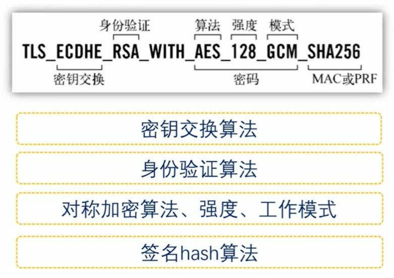
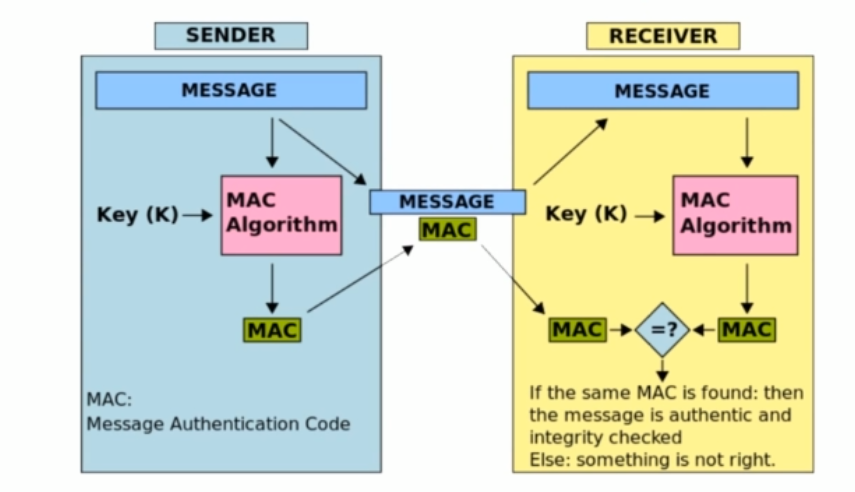
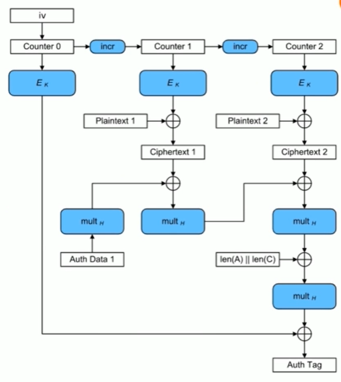
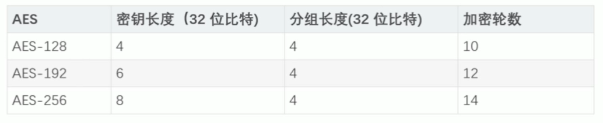
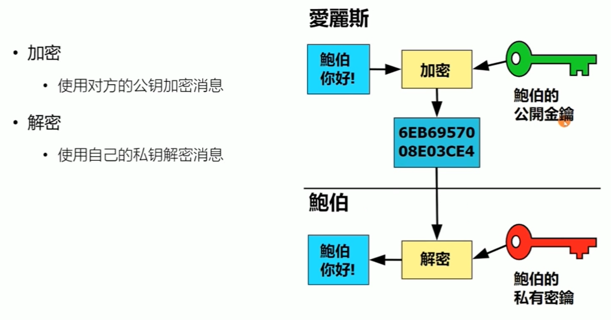
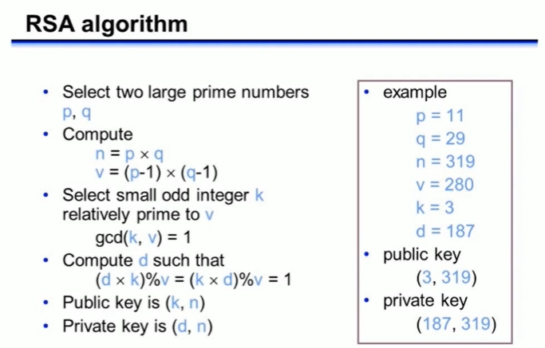
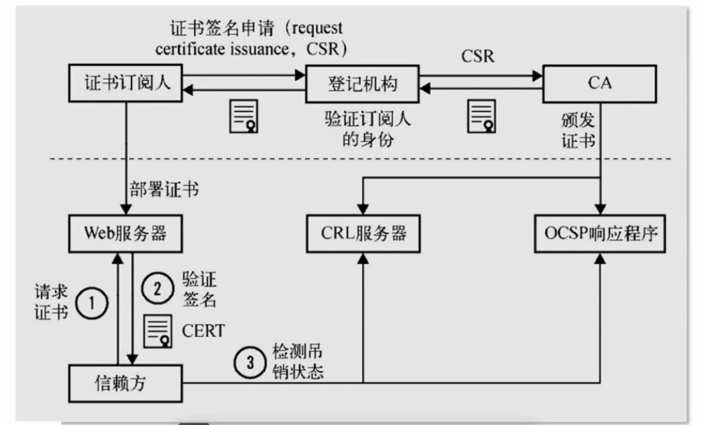
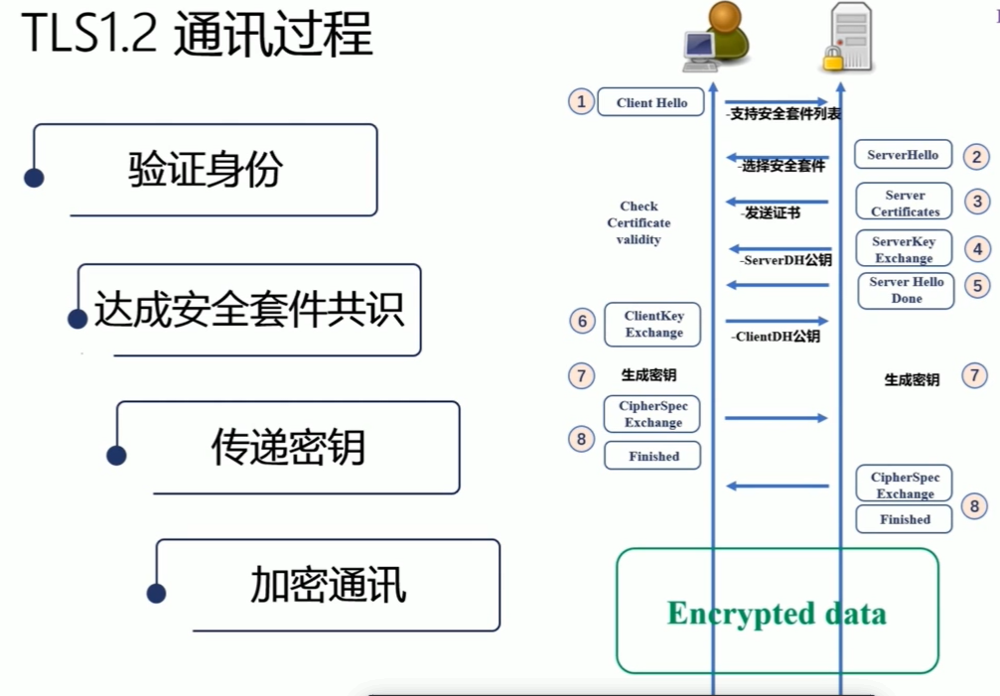

## TLS 简介

TLS（传输层安全）协议是一种用于保护网络通信安全的协议。它建立在传输层（Transport Layer）之上，为应用层提供安全的通信环境。

## TLS 设计目的

- 身份验证， 确认通信上方是否时对的人
- 保密性， 信息安全
- 完整性， 保证传输消息的完整性

## TLS 协议组成部分

- Record 记录协议
  - 对称加密
- Handshake 握手协议
  - 验证通讯双方的身份（通过证书完成）
  - 交换加密的安全套件
  - 协商加密参数

### TLS 安全密码套件

TLS1.2 安全套件 如下图



## 对称加密

加密和解密是同一把钥匙，称为对称加密

常见的对称加密算法有 ： AES、DES、3DES、Blowfish 等

### 对称加密与 XOR 异或运算

对称加密主要基于 XOR 异或运算

说异或之前，先说基本的逻辑运算

与逻辑， 有 0 出 0， 全 1 出 1

用代码表示

```js
0 && 0; // 0
0 && 1; // 0
1 && 1; // 1
```

或逻辑， 有 1 出 1， 全 0 出 0

用代码表示

```js
0 || 0; // 0
0 || 1; // 1
1 || 1; // 1
```

非运算，取反操作

用代码表示

```js
!0; // 1
!1; // 0
```

异或逻辑， 不同出 1， 相同出 0

用代码表示

```js
0 ^ 0; // 0
0 ^ 1; // 1
1 ^ 1; // 0
```

以上的逻辑运算，通常情况下，是需要对字符转二进制的

比如下面的例子

```js
const a = 3; // 二进制是 0011
const b = 5; // 二进制是 0101
a ^ b; // 根据上面说的规则得到：0110 ，这个转换为十进制就是： 6
```

而对称加密怎么就基于 XOR 异或呢？

关键在于它的“不同出 1”

看下面的例子

假设密钥 rsa = 1010

明文 a = 0110

那么就得到密文， b = 1100

那密文与密钥异或会怎样？ 得到明文 a = 0110

但是有个问题，上面的密钥与明文长度是一致的，实际中只有少部分可能满足，那怎么处理？

### 填充 Padding

密钥固定长度，而敏文对于不足部分，采用 padding 填充

Block cipher 分组加密: 将明文分成多个等长的 Block 模块，对每个模块分别加解密

目的:当最后一个明文 Block 模块长度不足时，需要填充

填充方法

- 位填充:以 bit 位为单位来填充
  - 1011 1001 1101 0100 0010 0111 0000 0000
- 字节填充:以字节为单位为填充
  - 补零: ... DD DD DD DD DD DD DD DDIDD DD DD DD 00 00 00 00
  - ANSI X9.23: ... DD DD DD DD DD DD DD DDIDD DD DD DD 0 00 00 04
  - ISO 10126: . DD DD DD DD DD DD DD DDIDD DD DD DD 81 A6 23 04
  - PKCS7 (RFC5652) : ... DD DD DD DD DD DD DD DDI DD DD DD DD 04 04 04 04

但是简单分模块，还不足以满足其安全性，需要更强的模式

### 对称加密的工作模式

分组工作模式 Block cipher mode of operation ， 它允许使用同一个分组密码密钥对于一块的数据进行加密，并保证其安全性

分组工作模式中，有

- ECB（Electronic codebook）模式

  - 直接将明文分解为多个块，对每一块独立加密，但是缺点是无法隐藏数据特征,因为每一块加密都是同一个 key,加密操作也一样，很容易推导

- CBC（Ciper-block chaining） 模式

  - 每个明文块先与前一个密文进行异或后再进行加密
  - 缺点： 虽然将加密步骤复杂了，但是加密的过程变成了串行操作，因为下一步要知道上一步的加密结果，加密可能会很慢

- CTR (Counter) 模式
  - 通过递增一个加密技术去以产生连续的密钥流
  - 缺点： 不能提供密文消息完整性（这里指传输的过程可能发生丢失后，无法确认消息完整性）

要验证完整性，那么引入 hash 函数，

引入 hash 函数之后，就可以采用 mac(Message Authentication Code),验证消息的完整性

过程如下图



有了 mac 后，就产生一个新的模块

- GCM 模式（Galois/Counter Mode）
  - CTR + GMAC

它工作过程如下



## AES 加密

介绍用的比较多的对称加密算法 AES

AES(Advanced Encryption Standard) 加密算法

- 为比利时密码学家 Joan Daemen 和 Vincent Rijmen 所设计，又称 Rijndael 加密算法
- 常用填充算法: PKCS7
- 常用分组工作模式： GCM

### AES 的三种密钥长度

主要分为下面三种



### AES 的加密步骤

1. 把明文按照 128bit（16 字节）拆分成诺干个明文块，每个明文块是 4\*4 矩阵

2. 按照选择的填充方式来填充最后一块明文块

3. 每一个明文块利用 AES 加密器和密钥，加密成密文块

4. 拼接所有的密文块，成为最终的密文结果

## 非对称加密

加密和解密，都有一对密钥

- 公钥： 向对方公开

- 私钥： 仅自己使用

下图是一个简单的案例



### RSA 算法中公私钥的产生

rsa 的公私钥主要通过下面过程产生



步骤解析

1. 随机选择两个不相等的质数 p 和 q

2. 计算 p 和 q 的乘积 n (明文小于 n)

3. 计算 n 的欧拉函数 v= &(n)

4. 随机选择一个整数 k , 要求： 1 < k < v, 且 k 与 v 互质

5. 计算 k 对于 v 的模板反元素 d

6. 公钥： (k, n)

7. 私钥： (d, n)

### RSA 算法加密过程

- 加密: c= mk (modo)

  - m 是明文，c 是密文

- 解密: m=c 的 d 次方 (mod n)
  - 举例:对明文数字 123 加解密
  - 公钥(3,319)加密
    - 123 的三次方 mod 319 = 140
    - 对 140 密文用私钥(187,319)解密
      - 140 的 187 次方 mod 319 = 123
  - 私钥 (187,319)加密
    - 123 的 187 次方 mod 319 = 161
    - 公钥 (3,319)解密
      - 161 的三次方 mod 319 = 123

过程的公钥和私钥，采用上面的图中的数据

### 非对称密码应用： PKI 证书体系

#### 非对称密码应用:数字签名

- 基于私钥加密，只能使用公钥解密:起到身份认证的使用

- 公钥的管理: Public Key lnfrastructure (PKI) 公钥基础设施
  - 由 Certificate Authority (CA) 数字证书认证机构将用户个人身份与公开密钥关联在一起
  - 公钥数字证书组成
    - CA 信息、公钥用户信息、公、权威机构的签字、有效期
  - PKI 用户
    - 向 CA 注册公钥的用户
    - 希望使用已注册公钥的用户

PKI 体系，如下图



#### 证书类型

DV 证书

OV 证书

EV 证书

### 非对称密码应用： DH 密钥交换协议

由客户端生成对称加密的密钥，没有前向保密性

采用 DH 密钥交换解决前向保密性问题

DH 密钥交换，可以让双方在完全没有对方任何预先消息的条件下通过不安全信道创建起一个密钥

DH 过程如下
1、 Client 先发送一个 request1,Server 收到后协商生成一对公私钥 S，并把公钥 1 返回给 Client
2、 Client 接收公钥 1 后，根据公钥 1 也生成了一对公私钥 C, 然后把公钥 2 给 Server
3、 Client 和 Server 根据对方的公钥以及自己的私钥通过特定算法生成一个密钥 K，这样就可以解决前向保密性。(因为这个密钥是随机生成的)

而且密钥 K, 可以作为后续 TLS 的 GCM 模式下的堆成加密密钥

DH 交换协议也有问题

- 那就是中间人攻击

中间人攻击（Man-in-the-Middle Attack，简称 MITM 攻击）是一种网络安全攻击方式。在这种攻击中，攻击者插入自己作为通信双方之间的"中间人"，并窃取、篡改或监听双方之间的通信。

解决中间人攻击，就是采用上面所说的 PKI 体系进行身份验证

- DH 协议依赖于某些数学问题的计算难度，如离散对数问题，对于大数值来说可能计算代价较高。

将 DH 协议升级为椭圆曲线 Diffie-Hellman（ECDH）主要是出于效率和安全性的考虑。ECDH 基于椭圆曲线密码学，相对于传统的 DH 协议，具有以下几个优势：

1. 更小的密钥尺寸：ECDH 可以使用比 DH 协议更小的密钥尺寸达到相同的安全级别。这导致计算速度更快，密钥交换所需的带宽更少。

2. 提高的性能：椭圆曲线密码学中的数学运算通常比传统的 DH 协议更快，使得 ECDH 在计算和响应时间方面更加高效。

3. 增强的安全性：相对于传统的 DH 协议，椭圆曲线密码学提供了更高级别的安全性，使用相同的密钥尺寸。这是由于椭圆曲线数学的复杂性，使其对某些攻击类型更具抵抗力。

4. 前向保密性：ECDH 提供前向保密性，这意味着即使攻击者在未来获取了一方的私钥，也无法用来解密使用 ECDH 加密的过去通信内容。

## TSL 通讯过程

整合上面的学习，TLS 的整个通讯过程如下



## TLS 与量子通讯

DH 或者 EDCH 都有可能让快速计算的计算机破解密码

### TLS 密码学回顾

- 通讯双方在身份验证的基础上，协商出一次性的、随机的密钥
  - PKI 公钥基础设施
  - TLS 中间件生成一次性的、随机的密钥参数
  - DH 系列协议基于非对称加密基数协商出密钥
- 使用分组对称加密算法，基于有限长度的密钥将任意长度的明文加密传输

  - 密钥位数
  - 分组工作模式

克劳德-艾尔伍德-香农在信息论中讲述

- 证明 one-time-pad(OTP)的绝对安全性

  下面是决定性的三个条件

  - 密钥是随机生成的（依赖系统时钟）
  - 密钥的长度大于等于明文长度(分组模式可以解决)
  - 相同的密钥只能使用一次

如何传递密钥？

QKD 与光偏振原理

- 量子密钥分发 quantum key distribution, 简称 QKD

  - 量子力学： 任何对量子系统的测量都会对系统产生干扰
  - QKD: 如果有第三方试图窃听密码，则通信的双方便会察觉（基于概率察觉）

  （横向波和纵向波通过光栅时是不同的，借助这个可以算出光波通过率）

### 量子通讯 BB84 协议

BB84 协议， 由 Charles Bennett 与 Gilles Brassard 在 1984 年发表
