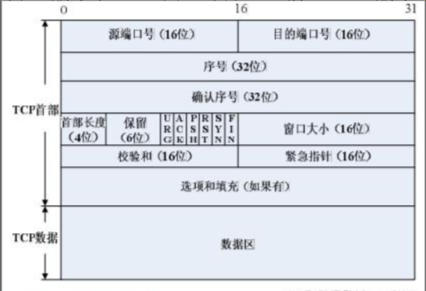
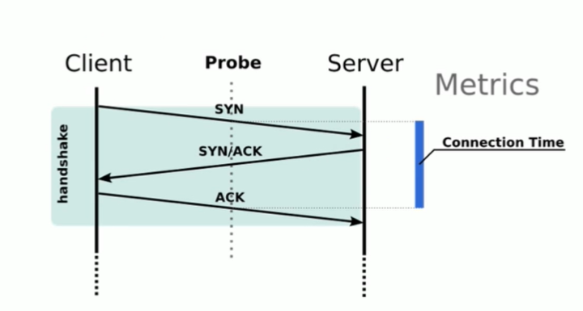

## TCP 协议

TCP/IP 前身 ARPA: NCP 协议

TCP: 面向连接的、可靠的、基于字节流的传输层通信协议

- 面向连接的： 1 对 1 的连接，像 udp 是 1 对多

- 可靠的：无论过程中链路发生什么变化，都能确保报文能到达接收方

- 基于字节流的： 消息是没有边界的，无论有多大都可以传输。 字节是有序的，即使先接收到后一个字节也不能扔给应用层处理

IP: 根据 IP 地址穿越网络传送数据

## TCP 协议特点

也可以说 TCP 解决的问题

- 在 IP 协议上，解决网络通讯可依赖问题

  - 点对点（不能广播、多播），面向连接

  - 双向传递（全双工）【websocket 就是使用 tcp 暴露出去的全双工通信特点】

  - 字节流： 打包成报文段、保证有序接收、重复报文自动丢弃

    - 缺点： 不维护应用报文的边界（比如 HTTP 必须自定义\r\n， content-length 自定义结尾、GRPC）
    - 优点： 不强制要求应用必须离散的创建数据块，不限制数据块大小

  - 流量缓冲： 解决速度不匹配问题

  - 可靠的传输服务(保证可达，丢包时通过重发进而增加时延实现可靠性)

  - 拥塞控制

## TCP 协议的任务

- 主机内的进程寻址
- 创建、管理、终止连接（因为 TCP 面向连接）
- 处理并将字节(8bit)流打包成报文段
- 传输数据
- 保持可靠性与传输质量
- 流控制与拥塞控制

## 如何标识一个 TCP 连接

TCP 是一个面向连接的协议，那么怎么标识一个 TCP 连接

通过四元组，定义唯一的连接

- TCP 四元组（源地址，源端口，目的地址， 目的端口）

  - 对于 IPv4 地址， 单主机最大 TCP 连接数位 2 的（32 + 16 + 32 + 16）次方

- 没有连接 ID: QUIC 协议

## TCP 报文格式

TCP 报文段由 TCP 首部和 TCP 数据区组成

## TCP 三次握手

TCP 三次握手建立连接

### 握手的目标

- 同步 Sequence 序列号

  - 初始序列号 ISN （Initial Sequence Number），每一个 Number 都会标识一个字节(字节流)，服务中的 ISN 与客户端的 ISN 是不同的

- 交换 TCP 通讯参数

  - 如 MSS、窗口比例因子、选择性确认、指定校验和算法

  ### 三次握手

  

  - SYN：同步信号
  - ACK: 确认标识

  #### 三次握手(1):
