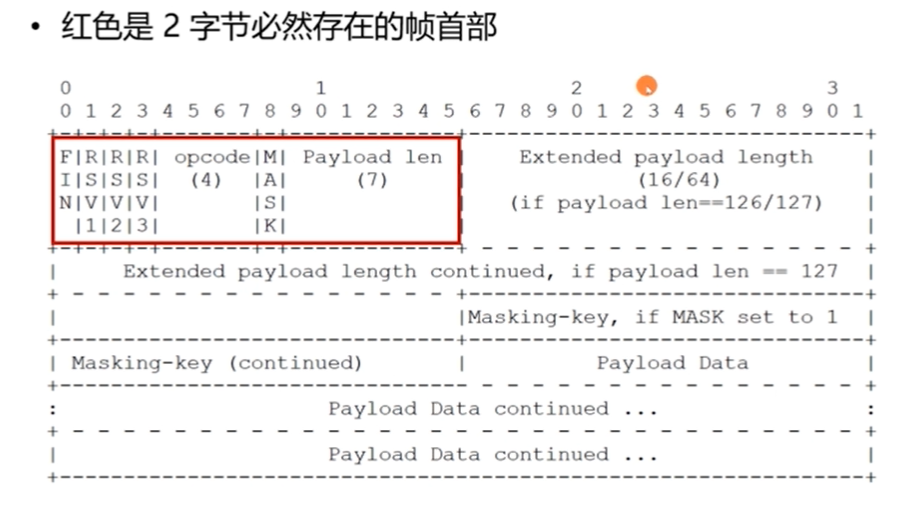
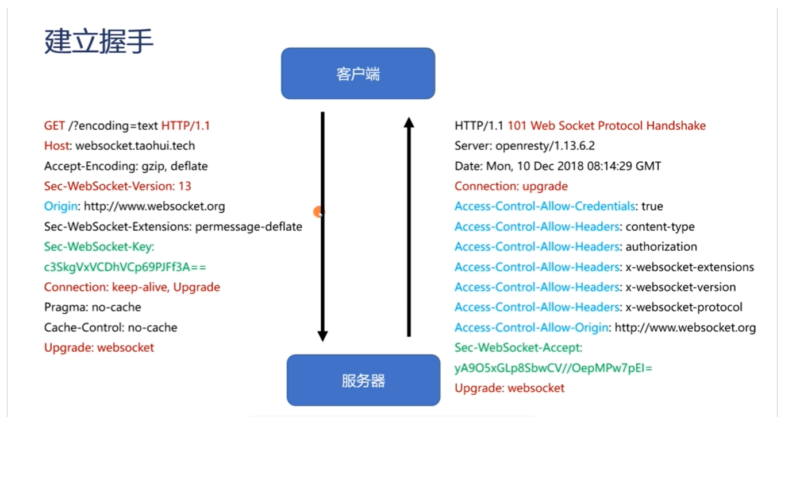
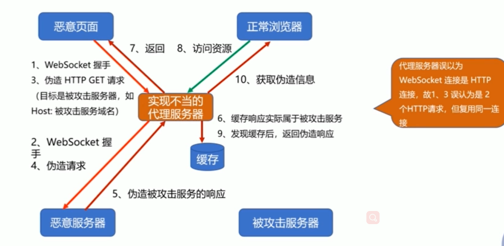
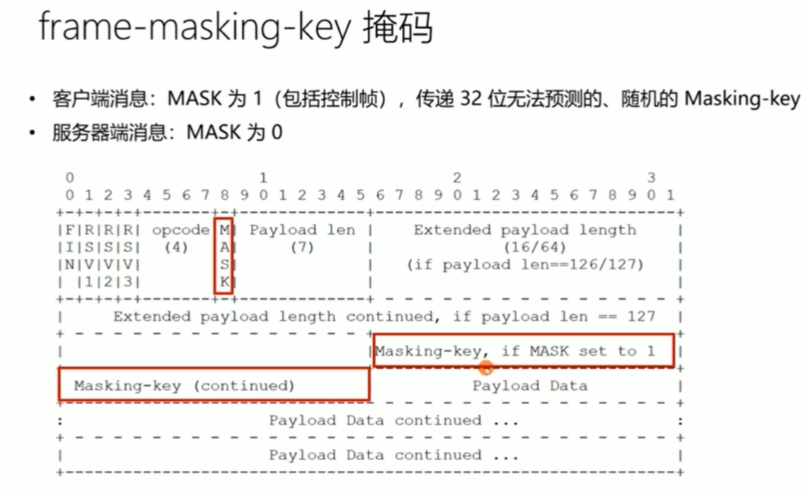
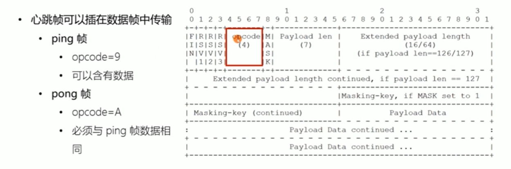

### Websocket 解决什么问题

如何及时获得更新？

从轮询到自动推送

### Websocket 的成本

- 实时性与可伸缩性
  - 牺牲了简单性
- 网络效率与无状态： 请求 2 基于请求 1
  - 牺牲了简单性与可见性

### 长链接的心跳保持

- HTTP 长链接只能基于简单的超时(常见为 65s)
- WebSocket 链接基于 ping/pong 心跳机制维持

### 兼容 HTTP 协议

- 默认使用 80 或者 443 端口
- 协议升级（其实就是握手，握手了就代表协议升级）
- 代理服务器可以简单支持（把 tcp 暴露给应用层）

设计哲学： 在 web 约束下暴露 TCP 给上层

- 元数据去哪了？
  - 对比： HTTP 协议头部会存放元数据（例如：header 头部中的 content-Type,content-encoding 等）
  - 由 WebSocket 上传输的应用层存放元数据（元数据的格式，由应用层自己编码决定）
- 基于帧：不是基于流（http、tcp）。tcp 基于流，质保保证发送方是有序的，那么接收方也是有序的
  - 每一帧要么承载 字符数据，要么承载二进制数据
- 基于浏览器的同源策略模型（非浏览器无效）
  - 可以使用 Access-Control-Allow-Origin 等头部
- 基于 URI、子协议支持同主机同端口上的多个服务

### WebSocket 协议格式

#### Frame 帧格式示意图

图中头部的 0、1、2、3 不是帧的意识，而是 10 个 bit(位)作为一个单位的标识，一共 32 位即 4 个字节（8bit = 1 byte）

ABNF 描述的帧格式

### 如何从 HTTP 升级到 WebSocket

URI 格式

- ws-URI = "ws:""//" host [ ":" port ] path ["?" query ]
  - 默认 port 端口 80
- wSS-URI = "wss:" "//" host [ ":" port ] path [ "?" query ]
  - 默 port 端口 443
- 客户端提供信息
  - host 与 port:主机名与端口
  - shema:是否基于 SSL
  - 访问资源: UP
  - 握手随机数: Sec-WebSocket-Key（必须字段，一个 base64 编码的字符产，后续讲述生成规则）
  - 选择子协议: Sec-WebSocket-Protocol
  - 扩展协议: Sec-WebSocket-Extensions(比如压缩)
  - CORS 跨域: Origin

### 握手

图中的红色部分为必须字段，例如，必须是 get 请求，必须 http/1.1， upgrade:websocket,

图中绿色也是必须字段

#### 如何证明握手被服务器接手？ 预防意外

- 请求中的 Sec-WebSocket-Key 随机数
  - 例如 Sec-WebSocket-Key: A1EEou7Nng6+BBZoAZqWIg==
- 响应中的 Sec-WebSocket-Accept 证明值

  - GUID (RFC4122) : 258EAFA5-E914-47DA-95CA-C5ABODC85B11

  - 值构造规则: BASE64(SHA1(Sec-WebSocket-KeyGUID))
    - 拼接值: A1EEou7Nng6+BBZoAZqWlg==258EAFA5-E914-47DA-95CA-C5ABODC85B11
    - SHA1 值: 713f15ece2218612fcadb1598281a35380d1790f
    - BASE 64 值: CT8V7lhhhL8rbFZgoGjU4DReQ8=
    - 最终头部: Sec-WebSocket-Accept: cT8V7OlhhhL8rbFZgoGjU4DReQ8=

### 传递消息时的编码格式

### 消息与数据帧

- Message 消息
  - 1 条消息由 1 个或者多个帧组成，这些数据帧属于同一类型
  - 代理服务器可能合并、拆分消息的数据帧
- Frame 数据帧
  - 持续帧
  - 文本帧、二进制帧

### 发送消息

- 确保 WebSocket 会话处于 OPEN 状态
- 以帧来承载消息，一条消息可以拆分多个数据帧
- 客户端发送的帧必须基于掩码编码（后面说到）
- 一旦发送或者接收到关闭帧，连接处于 CLOSING 状态
- 一旦发送了关闭帧，且接收到关闭帧，连接处于 CLOSED 状态
- TCP 连接关闭后，WebSocket 连接才完全被关闭

### 掩码及其所针对的代理污染攻击

为什么要做掩码处理?

掩码在消息格式中的位置

掩码如何防止缓存污染攻击？

- 目的:防止恶意页面上的代码，可以经由浏览器构造出合法的 GET 请求，使得代理服务器可以识别出请求并缓存响应
- 强制浏览器执行以下方法:
- 生成随机的 32 位 frame-masking-key，不能让 JS 代码猜出(否则可以反向构造)
- 对传输的包体按照 frame-masking-key 执行可对称解密的 XOR 异或操作，使代理服务器不识
  望
- 消息编码算法:
- j=iMOD4
- transformed-octet-i = original-octet-i XOR masking-key-octet-j

### 如何保持会话心跳？

心跳帧

### 关闭会话的方式

- 控制帧中的关闭帧:在 TCP 连接之上的双向关闭
  - 发送关闭帧后，不能再发送任何数据
  - 接收到关闭帧后，不再接收任何到达的数据
- TCP 连接意外中断
