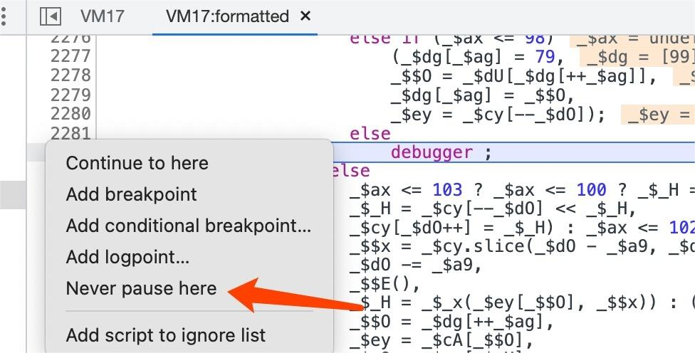
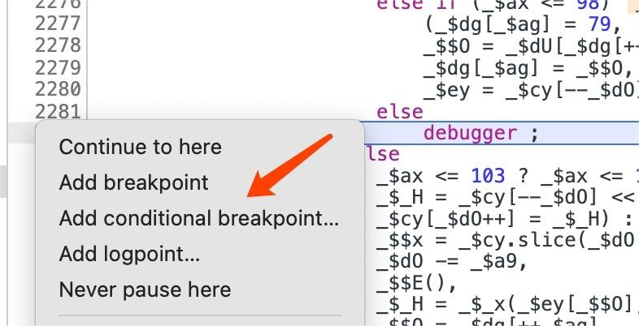
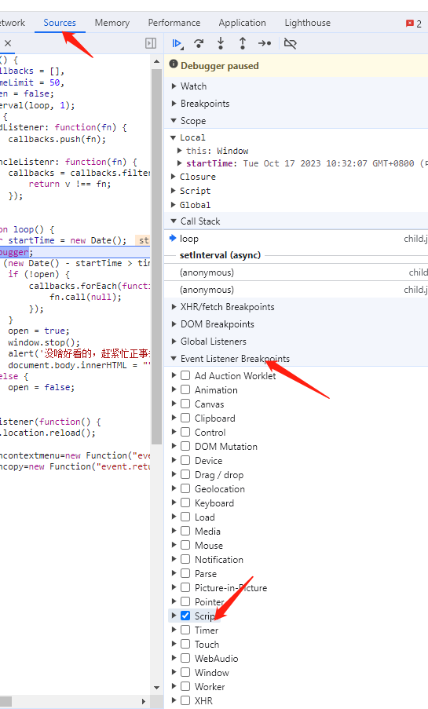

## 常见 debugger 实现

1、 直接使用 debugger

2、使用 eval（）函数

```js
eval("debugger")
eval('(function() {var a = new Date(); debugger; return new Date() - a > 100;}())'
```

3、定时器触发

```js
setInterval(function () {
  debugger;
}, 1000);
```

4、其他方式

```
（1）Function("debugger").call()/apply() 或赋值 bind()
（2）xxx.constructor("debugger").call("action")
（3）Fuction.constructor("debugger").call("action")
（4）(function(){return !![];}["constructor"]("debugger")["call"]("action"))
（5）eval('(function() {}["constructor"]("debugger")["call"]("action"));')
```

## 防止 debugger 触发方式

### 方式一： Never pause here

直接在出现 debugger 的位置的最左边，鼠标右键，弹出如下菜单，选择【never pause here】



### 方式二： 添加条件断点

在 JS 代码 debugger 行数位置的最左侧点击右键，添加条件断点（满足条件才会进入断点），将条件设置为 false，就是条件永远不成立，永远不会断下来。



如果是简单的 debugger 断点，直接用上边的方式就可以，如果是通过定时器触发的 debugger 断点，就需要进行 Hook 处理了。

### 方式三：Hook 解决无限 debugger 函数

通过定时器实现的 debugger，可以在进入定时器代码之前进行 hook，修改定时器的逻辑。也可以使用 FD 或者油猴插件进行 hook。

定时器实现的 debugger 形式如下：

```js
setInterval(function () {
  debugger;
}, 1000);
// 此处就是每过1000毫秒就执行一次参数一的方法，就会一直debugger下去
```

- 步骤 1， 设置 script

  在 Sources 面板设置 script 断点，这一步的目的，是为了让浏览器在刚运行时就被断下来，以方便进行 Hook
  

  因为 debugger，不确定使用上面提到的哪种方式进行，所以下面的 hook 尽量包括上面的情况

- 步骤 2，Hook 无限 debugger 函数

  - Hook Function 构造器函数

  ```js
  Function.prototype.__constructor_back = Function.prototype.constructor;
  Function.prototype.constructor = function () {
    if (arguments && typeof arguments[0] === "string") {
      //alert("new function: "+ arguments[0]);
      if ("debugger" === arguments[0]) {
        //arguments[0]="console.log(\"anti debugger\");";
        //arguments[0]=";";
        return;
      }
    }
    return Function.prototype.__constructor_back.apply(this, arguments);
  };
  ```

  - Hook eval 函数

  ```js
  eval_ = eval;
  //下面这样写，是为了过瑞数的 eval.toString 检测
  eval = function (a) {
    if (a == "debugger") {
      return "";
    } else {
      return eval_(a);
    }
  };
  ```

  // 或者如下：

  ```js
  var my_eval = eval;
  eval = function (arg) {
    if (arg.indexOf('debugger') != -1)  {
    return function () {
   };
  }
  return my_eval(arg);
  }
  var \_old = Function.prototype. toString.call
  Function.prototype.toString.call =  function (arg) {
  if (arg === eval) {
  return "function eval() { [native   code] }"
  }
  return \_old(arg);
  }
  ```

  - Hook setInterval 函数

  业务代码和 setInterval 无关时

  ```js
  setInterval = function () {};
  ```

  业务代码和 setInterval 有关时

  ```js
  setInterval_back = setInterval;
  setInterval = function (a, b) {
    if (a.toString().indexOf("debugger") != -1) {
      return null;
    }
    return setInterval_back(a, b);
  };
  ```

### 方式四：本地替换 js

直接使用浏览器开发者工具替换修改 js（Sources 面板 --> Overrides），或者通过 FD 工具替换。

这种方式的核心思路，是替换 JS 文件中的 debugger 关键字，并保存为本地文件，在请求返回的时候、通过正则匹配等方式、拦截并替换返回的 JS 代码，以达到绕过 debugger 的目的。也可以直接删掉相关的 debugger 代码。

### 方式五：使用 FD、油猴等插件 Hook

使用这种方法，就不需要再打 script 断点。

注意：如果 script 断点无法在 debugger 函数之前断下来，那就只能用这种方式进行拦截 Hook，才能过掉 debugger。
